<p align="center">
  
</p>

<div align="center">


# 🔥 Pharma Data Cleaning & Enrichment Pipeline


> Five notebooks that turn a raw pharmaceutical product CSV into cleaned, FDA-verified active ingredients and validated trade names — ready for downstream analytics or graph-loading.

</div>


<a id="toc"></a>
<p align="center"></p>

<table>
<tr><td>

| Section | Section |
|---|---|
| ✨ [Features](#features) | 📦 [Module Details](#module-details) |
| 🛠 [Tech Stack](#tech-stack) | 🤝 [Contributing](#contributing) |
| 🏗 [Architecture](#architecture) | 📄 [License](#license) |
| 📁 [Folder Structure](#folder-structure) | 🙏 [Acknowledgments](#acknowledgments) |
| ⚠️ [Prerequisites](#prerequisites) | 📬 [Contact](#contact) |
| 🚀 [Installation](#installation) | 📖 [Usage](#usage) |
| 🔧 [Configuration](#configuration) | |

</td></tr>
</table>


<a id="features"></a>
<p align="center"></p>

**Initial standardization**
- Drops unused columns (`updated`, `created`, `new_price`, `id`, `Therapeutic_Group`) and lowercases/strips key text fields
- Collapses messy free-text dosage forms (typo fixes + consolidation map) into a clean `form_standardized` category

**Active ingredient cleaning**
- Decodes encoded placeholder tokens, fixes known spelling errors, expands B-vitamin shorthand (`b12` → `cobalamin`, etc.) and omega notation (`omega-3-6-9` → `omega 3 + omega 6 + omega 9`)
- Filters out garbage entries, cosmetic-only products, and non-drug supplement tokens
- Splits multi-ingredient combination products into sorted, `+`-joined canonical strings

**Reference verification**
- Fuzzy-matches cleaned ingredients against an optional reference list using `difflib` sequence matching
- LLM system prompt scaffolding for INN (International Nonproprietary Name) canonicalization

**FDA enrichment**
- Extracts the full unique-ingredient vocabulary from the cleaned dataset
- Validates each ingredient with a Groq-hosted LLM, then cross-checks confirmed drugs against the OpenFDA drug label API for brand names, manufacturers, and dosage forms
- Filters to ingredients confirmed as both `is_drug` and `fda_found` before export

**Trade name cleaning & validation**
- Regex-strips dosage-form words and pack/volume counts (`"Aspirin 500mg Tablet 20 tabs"` → `"Aspirin 500mg"`) from raw brand names
- Optionally validates cleaned trade names via an LLM, filtering by a configurable confidence threshold

**Merge utilities**
- Consolidates any folder of CSVs into one merged file, with batch support across multiple folders

<p align="right"><sub><a href="#toc">↑ back to top</a></sub></p>


<a id="tech-stack"></a>
<p align="center"></p>

| Category | Technology | Purpose |
|---|---|---|
| Language | Python 3 | All notebooks |
| Data wrangling | `pandas`, `numpy` | Loading, cleaning, transforming tabular data |
| Text matching | `difflib`, `re` | Fuzzy reference matching, regex-based text cleaning |
| HTTP | `requests` | Calls to Groq and OpenFDA APIs |
| Serialization | `json`, `csv` | Reading/writing intermediate and final outputs |
| File ops | `glob`, `pathlib`, `os` | Discovering and merging CSV files |
| Runtime | Google Colab | `BASE_DIR` paths and commented `drive.mount()` calls assume Colab |
| LLM | Groq (`llama-3.1-8b-instant`) | Ingredient/trade-name validation and canonicalization |
| Reference data | OpenFDA `drug/label.json` | Brand names, manufacturers, dosage forms for confirmed drugs |

<p align="right"><sub><a href="#toc">↑ back to top</a></sub></p>


<a id="architecture"></a>
<p align="center"></p>

```
DataDoseDataset.csv (raw)
        │
        ▼
01_DataDose_Initial_Cleaning
  drop columns → lowercase/strip text → standardize dosage form
        │
        ▼
02_Active_Ingredient_Cleaning_and_Verification
  Part 1: clean_active_ingredient() → activeingredient_clean
  Part 2: fuzzy_match_ingredient() against optional reference list
        │
        ▼
03_FDA_Enrichment
  extract_unique_ingredients() → Groq validation → OpenFDA lookup
  → filter_confirmed_drugs()
        │
        ▼ (independent branch, needs a manually-curated "FinalV" CSV)
04_Tradename_Cleaning_and_Validation
  clean_tradename_text() → optional LLM validation → confidence filter

        ⋮ (used anywhere in the flow)
05_Merge_Utilities
  merge_csv_files() / batch_merge_folders() — consolidate CSV outputs
```

Notebooks 01 → 02 → 03 form the main linear path. Notebook 04 operates on a separately curated `DataDoseDataset_FinalV.csv` rather than an automatic output of 01–03, and notebook 05 is a general-purpose helper usable at any stage.

<p align="right"><sub><a href="#toc">↑ back to top</a></sub></p>


<a id="folder-structure"></a>
<p align="center"></p>

```
.
├── 01_DataDose_Initial_Cleaning.ipynb               # Drop columns, normalize text, standardize dosage form
├── 02_Active_Ingredient_Cleaning_and_Verification.ipynb  # Clean ingredient strings + fuzzy/LLM verification
├── 03_FDA_Enrichment.ipynb                          # Groq validation + OpenFDA lookup
├── 04_Tradename_Cleaning_and_Validation.ipynb       # Regex + LLM trade-name cleaning
├── 05_Merge_Utilities.ipynb                         # Generic CSV merge helpers
└── README.md                                        # This file
```

<p align="right"><sub><a href="#toc">↑ back to top</a></sub></p>


<a id="prerequisites"></a>
<p align="center"></p>

1. **Python 3** with `pandas`, `numpy`, `requests` installed (`pip install pandas numpy requests`)
2. **Google Colab** (recommended) or any environment where you can adjust the hard-coded `BASE_DIR` paths
3. Raw input dataset: `DataDoseDataset.csv`, containing at least an active-ingredient column (`activeingredient`, `ActiveIngredient`, `active_ingredient`, `ingredients`, or `Ingredients`) and a `form` column
4. *(Optional, for full enrichment)* A **Groq API key** for LLM-based ingredient/trade-name validation
5. *(Optional)* An **OpenFDA API key** — queries work without one, but a key raises rate limits
6. *(Optional)* A curated `DataDoseDataset_FinalV.csv` if you intend to run notebook 04

<p align="right"><sub><a href="#toc">↑ back to top</a></sub></p>


<a id="installation"></a>
<p align="center"></p>

1. **Open the notebooks in Google Colab** (or your local Jupyter environment):
   ```text
   Upload 01_DataDose_Initial_Cleaning.ipynb ... 05_Merge_Utilities.ipynb
   ```

2. **Mount Google Drive** (if using Colab) by uncommenting the setup cell in each notebook:
   ```python
   from google.colab import drive
   drive.mount('/content/drive')
   ```

3. **Update the path variables** near the top of each notebook to match your data location:
   ```python
   BASE_DIR = '/content/drive/MyDrive/DataDoseDepi'   # adjust as needed
   ```

4. **Install dependencies** if running outside Colab:
   ```bash
   pip install pandas numpy requests
   ```

5. **Add API keys** where enrichment/validation is needed (notebooks 02, 03, 04):
   ```python
   GROQ_API_KEYS = ["your-groq-api-key"]
   OPENFDA_API_KEY = "your-openfda-key"   # optional
   ```

<p align="right"><sub><a href="#toc">↑ back to top</a></sub></p>


<a id="usage"></a>
<p align="center"></p>

#### Basic Usage — run the pipeline in order

```text
1. Run 01_DataDose_Initial_Cleaning.ipynb       → DataDoseDataset_Cleaned.csv
2. Run 02_Active_Ingredient_Cleaning_and_Verification.ipynb → DataDoseDataset_ActiveIngredient_Cleaned.csv
3. Run 03_FDA_Enrichment.ipynb                  → ingredients_fda_results.csv / .json
```

#### Advanced Usage — cleaning a single ingredient string

```python
clean_active_ingredient("Vit. B Complex + Vitamin C 500mg Tablet")
# → normalizes B-complex shorthand, strips dose units, splits on '+'
```

```python
clean_tradename_text("Amoxicillin Capsule 250mg 30 caps")
# → 'Amoxicillin 250mg'
```

#### Common Scenario — running the FDA enrichment pipeline on a sample

```python
results = run_full_pipeline(sample_size=20)
```

#### Common Scenario — merging CSV outputs from a folder

```python
result = merge_csv_files(
    folder_path="/content/drive/MyDrive/DataDoseDepi/DataSets",
    output_file="merged_output.csv",
    skip_pattern="merged",
)
```

<p align="right"><sub><a href="#toc">↑ back to top</a></sub></p>


<a id="configuration"></a>
<p align="center"></p>

| Variable | Notebook(s) | Default | Description |
|---|---|---|---|
| `BASE_DIR` | 01, 02, 03 | `/content/drive/MyDrive/DataDoseDepi` | Root folder for inputs/outputs |
| `BASE_DIR` | 04 | `/content/drive/MyDrive/DataDoseClean/Tradename Clean` | Separate root used only by notebook 04 |
| `INPUT_FILE` | 01, 02 | `DataDoseDataset.csv` | Raw source dataset |
| `OUTPUT_FILE` | 01 | `DataDoseDataset_Cleaned.csv` | Output of initial cleaning |
| `CLEANED_CSV` | 02, 03 | `DataDoseDataset_ActiveIngredient_Cleaned.csv` | Cleaned-ingredient dataset |
| `INPUT_CSV` | 04 | `DataDoseDataset_FinalV.csv` | Dataset to validate trade names on (not auto-produced by 01–03) |
| `OUTPUT_CSV` / `OUTPUT_JSON` | 03 | `ingredients_fda_results.csv` / `.json` | FDA enrichment results |
| `OUTPUT_CSV` / `OUTPUT_JSON` | 04 | `dataset_with_validated_tradenames.csv` / `tradenames_validated.json` | Validated trade names |
| `GROQ_API_KEYS` | 02, 03, 04 | `[]` (empty) | Groq API key list — LLM steps no-op until populated |
| `OPENROUTER_API_KEYS` | 02 | `[]` (empty) | Optional alternate LLM provider, defined but unused in shown cells |
| `GROQ_MODEL` | 02, 03, 04 | `llama-3.1-8b-instant` | Model used for validation calls |
| `OPENFDA_API_KEY` | 03 | `""` (empty) | Optional key for higher OpenFDA rate limits |
| `CONFIDENCE_THRESHOLD` | 04 | `0.85` | Minimum LLM confidence to keep a validated trade name |
| `fuzzy_match_ingredient` threshold | 02 | `0.85` | Minimum `difflib` ratio to accept a reference match |

> **Note:** All `GROQ_API_KEYS` lists default to empty. Without a key, the cleaning/regex logic still runs, but LLM validation calls in notebooks 02–04 simply return `None`/`False` rather than failing.

<p align="right"><sub><a href="#toc">↑ back to top</a></sub></p>


<a id="module-details"></a>
<p align="center"></p>

<details open>
<summary><b>📓 01_DataDose_Initial_Cleaning.ipynb</b></summary>
<br/>

> Loads the raw dataset and applies first-pass standardization.
- **Key Components:** column-drop step, text lowercasing/stripping, dosage-form typo-fix + consolidation mapping → `form_standardized`
- **Dependencies:** `pandas`, `numpy`
- **Notes:** Rows with a null/`"nan"` `form` value are dropped before standardization.

</details>

<details>
<summary><b>📓 02_Active_Ingredient_Cleaning_and_Verification.ipynb</b></summary>
<br/>

> Two-part notebook: cleans raw ingredient text into canonical `+`-joined strings, then offers fuzzy/LLM verification helpers.
- **Key Components:** `decode_encoded_tokens()`, `apply_spell_fix()`, `normalize_text()`, `normalize_omega()`, `is_cosmetic_entry()`, `clean_active_ingredient()`, `fuzzy_match_ingredient()`, `verify_ingredients()`
- **Dependencies:** `pandas`, `numpy`, `re`, `difflib`, `requests`
- **Notes:** `verify_ingredients()` only processes the first 100 unique ingredients (`unique_ingredients[:100]`) as a demo limit; the LLM verification call itself is not wired into `verify_ingredients()` in the current cells.

</details>

<details>
<summary><b>📓 03_FDA_Enrichment.ipynb</b></summary>
<br/>

> Validates ingredients via a Groq LLM and cross-references OpenFDA drug labels.
- **Key Components:** `extract_unique_ingredients()`, `call_groq_api()`, `query_openfda()`, `filter_confirmed_drugs()`, `run_full_pipeline()`
- **Dependencies:** `requests`, `pandas`, `json`
- **Notes:** `run_full_pipeline()` defaults to a `sample_size=10` demo run and is left commented out at the end of the notebook; a drug is only "confirmed" if both `groq.is_drug` and `fda.found` are true.

</details>

<details>
<summary><b>📓 04_Tradename_Cleaning_and_Validation.ipynb</b></summary>
<br/>

> Strips dosage-form and pack-count text from brand names, then optionally validates them via an LLM.
- **Key Components:** `_DOSAGE_FORM_RE`, `_PACK_VOLUME_RE` regex patterns, `clean_tradename_text()`, `validate_tradename_with_llm()`, `run_tradename_pipeline()`, `export_validated_tradenames()`
- **Dependencies:** `re`, `pandas`, `requests`
- **Notes:** Uses its own `BASE_DIR` (`Tradename Clean` subfolder), separate from notebooks 01–03; `run_tradename_pipeline()` defaults to processing only `df.head(sample_size)` rows.

</details>

<details>
<summary><b>📓 05_Merge_Utilities.ipynb</b></summary>
<br/>

> General-purpose CSV consolidation helpers, independent of the rest of the pipeline.
- **Key Components:** `merge_csv_files(folder_path, output_file, skip_pattern=None)`, `batch_merge_folders(folder_specs)`
- **Dependencies:** `pandas`, `glob`, `os`
- **Notes:** `merge_csv_files` concatenates rows via `pd.concat` without aligning differing column sets across files.

</details>

<p align="right"><sub><a href="#toc">↑ back to top</a></sub></p>


<a id="contributing"></a>
<p align="center"></p>

<div align="center">

1. Fork the repository
2. Create a feature branch (`git checkout -b feature/your-change`)
3. Commit your changes with a clear message
4. Push the branch and open a Pull Request describing what changed and why

</div>

<p align="right"><sub><a href="#toc">↑ back to top</a></sub></p>


<a id="license"></a>
<p align="center"></p>

<div align="center">

No `LICENSE` file is included in this repository. Add one (e.g. MIT, Apache 2.0) before distributing this project publicly.

</div>

<p align="right"><sub><a href="#toc">↑ back to top</a></sub></p>


<a id="acknowledgments"></a>
<p align="center"></p>

<div align="center">

| Technology | Use in this pipeline |
|---|---|
| [pandas](https://pandas.pydata.org/) · [NumPy](https://numpy.org/) | Data wrangling |
| [Groq](https://groq.com/) | LLM-hosted ingredient/trade-name validation |
| [OpenFDA](https://open.fda.gov/) | Drug label reference data |
| Python's built-in [`difflib`](https://docs.python.org/3/library/difflib.html) | Fuzzy matching |

</div>

<p align="right"><sub><a href="#toc">↑ back to top</a></sub></p>


<a id="contact"></a>
<p align="center"></p>

<div align="center">

No contact information was found in the provided files. Add a maintainer name, email, or issue-tracker link here before publishing.

</div>

<br/>

<div align="center">

*Cleaning Code — Pharma Data Cleaning & Enrichment Pipeline*<br/>
*Part of the DataDose Clinical Decision Intelligence Platform*

<br/>

<a href="#toc"></a>

</div>
