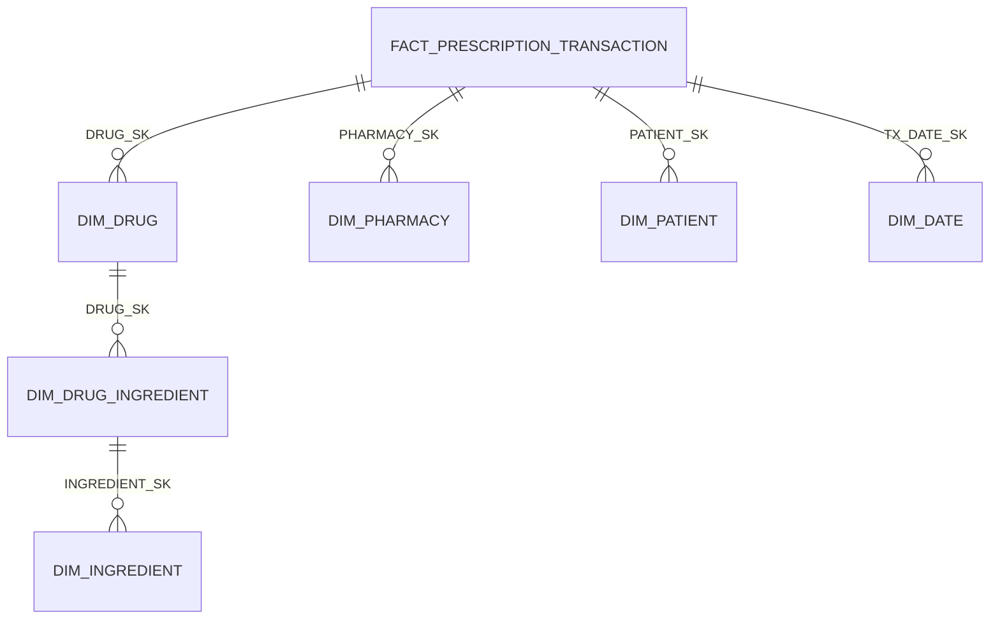

<p align="center">
  
</p>

<div align="center">

<br/>

<p align="center">
  <strong>DataDose — Pharmaceutical Drug Interaction Analytics Dashboard</strong><br/>
  Power BI reporting layer built on the <code>PHARMA_ANALYTICS_DB</code> Snowflake warehouse
</p>

<br/>

<p align="center">
  <a href="https://data-dose-powerbi-dashboard.lovable.app">
    
  </a>
</p>

<br/>

<p align="center">
  
  
  
  
  
  
</p>

<br/>

<table>
<tr>
  <td align="center"><br/><sub><b>Dataset Size</b></sub></td>
  <td align="center"><br/><sub><b>Per Record</b></sub></td>
  <td align="center"><br/><sub><b>Report Pages</b></sub></td>
  <td align="center"><br/><sub><b>Schema Version</b></sub></td>
</tr>
</table>

</div>


<a id="toc"></a>
<p align="center"></p>

<table><tr><td>

| Section | Section |
|---|---|
| 📊 [Overview](#overview) | 📈 [Dashboard Pages](#dashboard-pages) |
| 🗂️ [Data Model](#data-model) | 🔗 [Access](#access) |
| 🧮 [Key DAX Measures](#key-dax-measures) | 🛠️ [Tech Stack](#tech-stack) |
| 📄 [License & Confidentiality](#license--confidentiality) | |

</td></tr></table>


<a id="overview"></a>
<p align="center"></p>

DataDose is a pharmaceutical drug-safety analytics platform. This module covers the **Power BI reporting layer** built on top of the `PHARMA_ANALYTICS_DB` Snowflake warehouse — turning raw drug metadata and prescription transactions into interactive dashboards for drug safety, interaction risk, and pharmacy performance monitoring.

The dashboard surfaces insight across three core themes:

<table>
<tr>
<td width="33%" align="center" valign="top">

#### 💊 Drug Safety Profiles
Warnings, adverse reactions, and interaction counts per drug — surfaced at trade-name granularity with full drill-down support.

</td>
<td width="33%" align="center" valign="top">

#### ⚠️ Risk Scoring
A weighted composite risk score per drug and per patient, powered by the `Risk_Score` DAX measure and the `PATIENT_RISK_PROFILE` Snowflake table.

</td>
<td width="33%" align="center" valign="top">

#### 💉 Combination & Formulation Analysis
Single vs. combination products, dosage forms, and administration routes — revealing the full formulary landscape.

</td>
</tr>
</table>

| | |
|---|---|
| **Platform** | Power BI (Desktop / Service) |
| **Data Source** | Snowflake — `PHARMA_ANALYTICS_DB` |
| **Underlying Dataset** | `DataDoseDataset-Cleaned` (12,105 drug records, 18 fields) |
| **Deployment** | [data-dose-powerbi-dashboard.lovable.app](https://data-dose-powerbi-dashboard.lovable.app) |
| **Schema Version** | v3.0 |

<p align="right"><sub><a href="#toc">↑ back to top</a></sub></p>


<a id="data-model"></a>
<p align="center"></p>

The dashboard connects to a **star-schema warehouse** in Snowflake:



| Object | Type | Description |
|---|---|---|
| `FACT_PRESCRIPTION_TRANSACTION` | Fact table | One row per prescription fill — grain, clustering, risk scores |
| `DIM_DRUG` | Dimension (SCD2) | Drug master with `EFFECTIVE_DATE`, `EXPIRY_DATE`, `IS_CURRENT`, `RECORD_VERSION` |
| `DIM_INGREDIENT` | Dimension | Active pharmaceutical ingredients with `NEO4J_NODE_ID` and `NEO4J_LABELS` |
| `DIM_DRUG_INGREDIENT` | Bridge table | Many-to-many between drugs and ingredients |
| `DIM_PHARMACY` | Dimension | Pharmacy master with NPI, NCPDP, city, state |
| `DIM_PATIENT` | Dimension | De-identified patient (token only, no PII) |
| `DIM_DATE` | Dimension | Date spine, ISO week, fiscal calendar, holiday flag — populated 2020–2035 |
| `V_DRUG_SAFETY_SUMMARY` | View | Pre-aggregated per-drug safety KPIs for BI |
| `V_HIGH_RISK_PRESCRIPTIONS` | View | Real-time clinical monitoring surface |
| `DRUG_INTERACTION_SUMMARY` | Table | Interaction pair aggregation with Neo4j export tracking |
| `PHARMACY_RISK_SUMMARY` | Table | Daily pharmacy-level risk rollup |
| `PATIENT_RISK_PROFILE` | Table | Longitudinal patient risk snapshot |

> For the flat CSV-based build, the primary source is `DataDoseDataset-Cleaned` — containing per-drug fields: `dosage_form`, `route_of_administration`, `warnings_count`, `drug_interactions_count`, `adverse_reactions_count`, and `indications_count`. See the **DataDose Dimensional Model Guide** for the full star-schema, SCD2 design, and clustering strategy.

<p align="right"><sub><a href="#toc">↑ back to top</a></sub></p>


<a id="key-dax-measures"></a>
<p align="center"></p>

All measures are defined against `DataDoseDataset-Cleaned`. Full list in `Complete_List_of_ALL_Measures.txt`.

<details open>
<summary><b>📐 Base Aggregates</b></summary>
<br/>

| Measure | Description |
|---|---|
| `Total_Drug_Records` | Count of all drug records in the dataset |
| `Unique_Trade_Names` | Distinct trade name count |
| `Total_Warnings` / `Avg_Warnings` / `Max_Warnings` | Sum, average, and maximum warnings across all drugs |
| `Total_Interactions` / `Avg_Interactions` / `Max_Drug_Interactions` | Drug-drug interaction aggregates |
| `Total_Adverse_Reactions` / `Avg_Adverse_Reactions` / `Max_Adverse_Reactions` | Adverse reaction aggregates |
| `Total_Indications` | Count of therapeutic indications |

</details>

<details>
<summary><b>💊 Composition & Formulation</b></summary>
<br/>

| Measure | Description |
|---|---|
| `Combination_Products` / `Single_Products` | Count of combination vs. single-ingredient products (+ `%` variants) |
| `Injection_Count`, `Cream_Count`, `Drops_Count`, `Gel_Count` | Dosage form breakdowns |
| `Oral_Route_Count`, `Injection_Route_Count`, `Topical_Route_Count`, `Otic_Route_Count` | Route of administration breakdowns |

</details>

<details>
<summary><b>⚠️ Safety & Risk</b></summary>
<br/>

| Measure | Formula / Logic | Description |
|---|---|---|
| `Safe_Drug_Count` | `warnings = 0 AND interactions = 0 AND adverse_reactions = 0` | Drugs with zero safety signals |
| `Risky_Drug_Count` | `NOT Safe_Drug_Count` | Drugs with at least one safety signal |
| `Zero_Interaction_Count` | `drug_interactions_count = 0` | Subset with no known drug interactions |
| `Records_With_Adverse_Reactions` | `adverse_reactions_count > 0` | Drugs with at least one adverse reaction |
| `Risk_Score` | `(warnings × 0.4) + (interactions × 0.4) + (adverse_reactions × 0.2)` | **Weighted composite risk score** |
| `Total_Safety_Burden` | `warnings + interactions + adverse_reactions` | Per-category % of total included |
| `High_Risk_Drug_Name` | `TOPN(1, ...)` | Trade name with the single highest `Risk_Score` |
| `High_Risk_Drug_Score` | Companion to `High_Risk_Drug_Name` | Score value for the top-risk drug |

</details>

<p align="right"><sub><a href="#toc">↑ back to top</a></sub></p>


<a id="dashboard-pages"></a>
<p align="center"></p>

<table>
<tr>
<td width="20%" align="center" valign="top">

**1 · Executive Summary**

KPI cards — total records, unique drugs, avg. risk score, safe vs. risky split

</td>
<td width="20%" align="center" valign="top">

**2 · Safety Deep-Dive**

Warnings / interactions / adverse reactions by drug, therapeutic group, and dosage form

</td>
<td width="20%" align="center" valign="top">

**3 · Risk Explorer**

`Risk_Score` distribution, high-risk drug leaderboard, safety burden breakdown

</td>
<td width="20%" align="center" valign="top">

**4 · Formulation & Route**

Combination vs. single product mix, dosage form and route percentages

</td>
<td width="20%" align="center" valign="top">

**5 · Drug Detail Table**

`Adverse_Reactions_By_Trade` and `Warnings_By_Trade` for trade-name drill-down

</td>
</tr>
</table>

<p align="right"><sub><a href="#toc">↑ back to top</a></sub></p>


<a id="access"></a>
<p align="center"></p>

| Resource | Link |
|---|---|
| **Live Power BI Dashboard** | [https://data-dose-powerbi-dashboard.lovable.app](https://data-dose-powerbi-dashboard.lovable.app) |
| Data Warehouse | Snowflake `PHARMA_ANALYTICS_DB` |
| Setup Guide | `DataDose_Setup_Guide.docx` |
| Dimensional Model Guide | `DataDose_Dimensional_Model_Guide.docx` |

Connect Power BI Desktop to Snowflake via the built-in **Snowflake connector**:

```text
Server:    <your-account-id>.snowflakecomputing.com
Warehouse: PHARMA_WH
Database:  PHARMA_ANALYTICS_DB
Auth:      Username / Password
Mode:      Import (static dashboards) or DirectQuery (live data)
```

> ⚠️ Never commit Snowflake credentials to source control. Store secrets in **Azure Key Vault** (or your secrets manager of choice) as described in the Setup Guide.

<p align="right"><sub><a href="#toc">↑ back to top</a></sub></p>


<a id="tech-stack"></a>
<p align="center"></p>

<div align="center">


</div>

| Category | Technology | Purpose |
|---|---|---|
| **BI Layer** | Power BI Desktop / Service | Dashboard authoring and publication |
| **Warehouse** | Snowflake (Standard Edition, Azure) | `PHARMA_ANALYTICS_DB` — 4-layer star schema |
| **ETL** | Azure Databricks (PySpark) | Prescription event enrichment and Snowflake writes |
| **Dashboard Hosting** | [Lovable](https://lovable.app) | Public dashboard deployment |
| **Graph Export** | Neo4j via `V_DRUG_INTERACTION_GRAPH` | Optional downstream graph analytics |

<p align="right"><sub><a href="#toc">↑ back to top</a></sub></p>


<a id="license--confidentiality"></a>
<p align="center"></p>

<div align="center">

This project contains pharmaceutical safety data intended for **internal analytics use**.
Ensure compliance with your organization's data governance policies before sharing dashboard access externally.

See [LICENSE](LICENSE) file for full details.

</div>

<p align="right"><sub><a href="#toc">↑ back to top</a></sub></p>


<br/>

<div align="center">

*Power BI Dashboard — DataDose Pharmaceutical Drug Interaction Analytics*<br/>
*Part of the DataDose Clinical Decision Intelligence Platform*

<br/>

<a href="#toc"></a>

</div>
